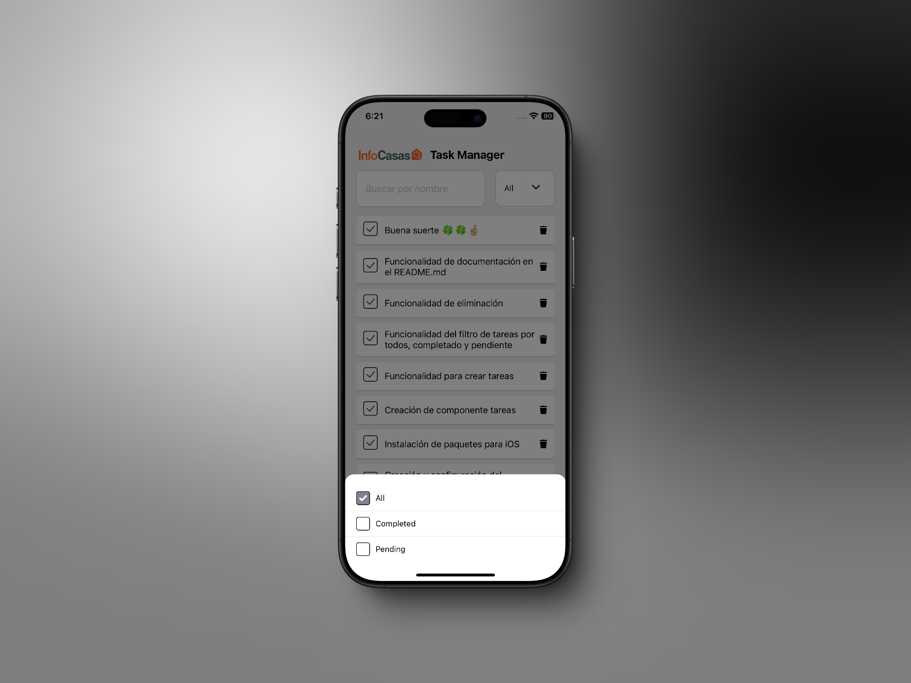

# Reto Infocasas App

## Descripción

La **Infocasas App** es una aplicación desarrollada para ofrecer una experiencia fluida y eficiente en la gestión de tareas. Esta guía proporciona instrucciones para instalar, configurar y ejecutar la aplicación en un entorno de desarrollo, así como para realizar pruebas en dispositivos iOS.

## Requisitos del Sistema

- **Node.js**: v19.9.0
- **npx**: v9.6.3
- **pod-install**: v0.2.2
- **Dispositivo de prueba**: iPhone 12
- **Versión mínima de iOS**: 13 y superior

## Instrucciones de Instalación

### Levantar la Aplicación por Primera Vez

Para inicializar la aplicación, sigue los siguientes pasos:

1. **Instalar las dependencias del proyecto:**
   ```bash
   npm install ✅
   ```
2. Iniciar el servidor de desarrollo:

   ```bash
   npm run start
   ```

3. Instalar las dependencias para iOS:

   ```bash
   npx pod-install
   ```

4. Abrir el proyecto en Xcode:

   - Navega hasta la carpeta _/ios/infocasas.xcworkspace_ y ábrela con Xcode. Asegúrate de abrir el archivo con la extensión .xcworkspace.

5. Seleccionar dispositivo y ejecutar:

   - En Xcode, selecciona el dispositivo o emulador para realizar el build. Ten paciencia, el proceso puede tardar unos minutos. ✅

   - - Nota Importante: Si nunca has emulado desde un USB conectado a tu iPhone, necesitarás dar permisos de desarrollador para que esto funcione. De lo contrario, no podrás emular la aplicación.

6. Disfruta de la aplicación.

## Levantar la Aplicación Frecuentemente

Para iniciar la aplicación en desarrollos posteriores, utiliza los siguientes pasos:

1. Iniciar el servidor de desarrollo:

   ```bash
   npm run start ✅
   ```

2. Seleccionar el dispositivo:

   - Asegúrate de que el dispositivo seleccionado sea un dispositivo iOS.

3. Reiniciar la aplicación instalada en el iPhone:

   - Abre la aplicación en tu iPhone y presiona R para reiniciarla.

## Contribuciones

Las contribuciones son bienvenidas. Si deseas contribuir a la Infocasas App, por favor crea un fork del repositorio y envía tus pull requests.

## Soporte

Si tienes alguna duda o necesitas asistencia, no dudes en abrir un issue en el repositorio o contactarnos a través de los canales de soporte establecidos.

## Fotos




